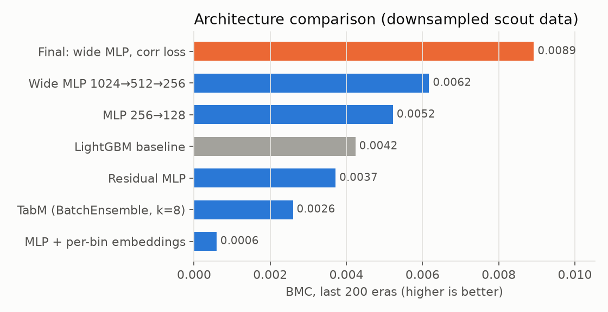
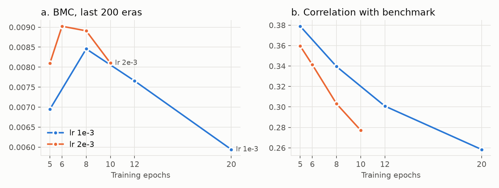

# Train Less, Contribute More: A Neural-Architecture Search for Numerai's Ender20 Target

*Numerai v5.3 · target `target_ender_20` · experiment `nn_arch_ender20` · 2026-10-04 · draft*

## Abstract

We search for the neural-network architecture that best predicts Numerai's ender20 target,
judged not by raw correlation but by Benchmark Model Contribution (BMC): the signal a model
adds beyond Numerai's own LightGBM benchmark. Across 35 cross-validated runs in six rounds
we compare plain, wide, deep and residual MLPs, a TabM-style BatchEnsemble, learned per-bin
feature embeddings, two loss functions, and the main training hyperparameters. The winner is
a plain 3-layer MLP (1024→512→256) trained with a per-era Pearson-correlation loss for only
6 epochs. Averaged over three seeds it reaches **BMC 0.0089** over the last 200 eras,
**2.1× the repo's LightGBM baseline** (0.0042) and 1.7× the best MSE-trained MLP from the
first round. The central finding is that *how much* the network is trained matters more than
its architecture: every added form of capacity failed, while BMC rose and fell with training
length along a single curve. Moderate training pushes predictions away from the benchmark
faster than it destroys raw signal. Past a sharp peak, it does both.

## 1. Introduction

Numerai pays for predictions that add information to its meta model. A model with high raw
correlation that merely re-discovers what the official benchmark (`v53_lgbm_ender20`)
already knows contributes little. BMC measures this directly: the correlation of a model's
predictions with the target after neutralizing them against the benchmark.

Gradient-boosted trees dominate this tournament, and the benchmark itself is a LightGBM
model. Neural networks have a natural advantage for BMC: their inductive bias differs from
trees, so even at lower raw correlation they may carry more *unique* signal. This study asks
which neural architecture, loss and training recipe maximizes that unique signal on ender20.

## 2. Method

**Data.** Numerai v5.3, `medium` feature set (780 features, each an integer bin 0–4).
Target `target` (= `target_ender_20`). Because experiments ran on a 16 GB laptop, the search
used every 4th era of train + validation (307 eras, 1.7M rows; "scout data"). The
confirmation step used every 2nd era at offset 1 (613 eras, 3.4M rows; "scale data"),
**which shares no eras with the scout data**.

**Validation.** Five expanding-window folds over eras with a 13-era embargo; the first fold
has no training data, so out-of-fold (OOF) predictions cover the last four folds (246 scout
eras). Every network trains for a fixed number of epochs. There is no early stopping, so no
validation information leaks into OOF scores.

**Metrics.** Primary: mean BMC over the last 200 OOF eras, against the official
`v53_lgbm_ender20` predictions. Also reported: BMC over all OOF eras, raw per-era correlation
("corr"), BMC Sharpe, and the average correlation between the model's predictions and the
benchmark's.

**Model family.** All networks are implemented in one wrapper,
[`TorchNNRegressor`](../../code/modeling/models/torch_nn.py), trained on Apple-silicon GPU (MPS):

| component | options tested |
|---|---|
| architecture | MLP; residual MLP (pre-LayerNorm blocks); TabM-style BatchEnsemble (k = 8 members sharing weights) |
| input encoding | scalar `(x − 2)/2`; learned 4-d embedding per feature bin |
| loss | MSE on random row batches; negative per-era Pearson correlation on batches of whole eras; hybrid |
| training | epochs, learning rate (AdamW, cosine schedule with warm-up), dropout, weight decay, input dropout, eras per batch |

**Baseline.** The repo's `small_lgbm_ender20_baseline` (LightGBM, 2,000 trees, 31 leaves) on
the identical data, features and folds.

**Protocol.** Rounds of 4–8 configurations, each changing one variable from the current
leader. Gaps smaller than seed noise (§4.4) were re-checked with 3-seed averages before
being trusted. The search stopped after two consecutive rounds without a confirmed
improvement, followed by the confirmation step on disjoint data.

## 3. Results

### 3.1 Architecture: simple wins



*Figure 1. BMC over the last 200 OOF eras on scout data. Blue bars share one untuned recipe
(MSE loss, 4 epochs); gray is the LightGBM baseline; orange is the final tuned model
(correlation loss, lr 2e-3, 6 epochs, 3-seed average).*

Under an identical recipe, the plain MLP beats LightGBM on BMC despite lower raw correlation
(0.0249 vs 0.0277). Its predictions correlate only 0.40 with the benchmark, against 0.49 for
LightGBM, so more of its signal is new. Every attempt to add structure did worse than the
plain MLP:

| architecture (MSE, 4 epochs) | corr | BMC | BMC last 200 | corr with benchmark |
|---|---|---|---|---|
| wide MLP 1024→512→256 | 0.0259 | 0.0061 | **0.0062** | 0.404 |
| MLP 256→128 | 0.0249 | 0.0053 | 0.0052 | 0.402 |
| LightGBM baseline | 0.0277 | 0.0042 | 0.0042 | 0.485 |
| residual MLP (2 blocks, width 256) | 0.0187 | 0.0036 | 0.0037 | 0.319 |
| TabM BatchEnsemble (k = 8) | 0.0213 | 0.0026 | 0.0026 | 0.393 |
| MLP with per-bin embeddings | 0.0157 | 0.0012 | 0.0006 | 0.312 |

Learned embeddings quadruple the input width (780 → 3,120) and overfit badly; treating each
bin as a single number is far better. Residual blocks and TabM ensembling also lost. Later
rounds confirmed the pattern: a deeper 512→256→128 network and a wider 2048→1024→512
network both failed to beat their simpler counterparts (Appendix).

### 3.2 Loss: correlation, but only with short training

Training directly on per-era Pearson correlation, the quantity Numerai scores, lowers the
benchmark correlation of predictions much further than MSE does. At 20 epochs it overfits
hard: training-era correlation reached 0.24 against 0.018 out of fold. Neither more dropout
and weight decay nor an added MSE term fixed this as well as simply training less.

### 3.3 Training amount is the dominant variable



*Figure 2. Correlation-loss MLP (256→128), single seeds. (a) BMC peaks at a training length
that depends on the learning rate. (b) Correlation with the benchmark falls steadily the
longer the network trains. The lr 2e-3 point at 8 epochs is a lucky seed; its 3-seed
average is 0.0083.*

One curve explains nearly every result in the study. As the network trains, its predictions
drift steadily away from the benchmark (Fig. 2b), which raises BMC, while raw correlation
holds roughly flat until a point and then falls. BMC therefore peaks just before raw
correlation collapses (Fig. 2a). Every knob that changes the *amount* of training lands on
this curve:

- **Epochs:** at lr 1e-3 the peak is 8 epochs; at lr 2e-3 it moves to 6.
- **Learning rate:** 5e-4 under-trains (BMC 0.0070); 3e-3 over-trains (corr falls to 0.0217).
- **Batch size:** 8 eras per batch halves the update count and under-trains (0.0078 vs 0.0085).
- **Regularization:** extra dropout at the optimal length behaves like *less* training. It
  raises raw correlation, pulls predictions back toward the benchmark (0.39 vs 0.34), and
  lowers BMC (0.0068 vs 0.0085). Input dropout does the same.

### 3.4 Seed noise and confirmation

Single-seed results vary by up to ±0.0006 BMC: a single lr 2e-3 run scored 0.0089, but its
3-seed average was 0.0083. The final candidates were therefore all judged on 3-seed averages:

| model (scout data, 3 seeds) | corr | BMC | BMC last 200 | BMC Sharpe | corr with benchmark |
|---|---|---|---|---|---|
| **wide 1024→512→256, corr loss, lr 2e-3, 6 epochs** | 0.0260 | **0.0088** | **0.0089** | 0.71 | 0.336 |
| narrow 256→128, corr loss, lr 2e-3, 6 epochs | 0.0262 | 0.0085 | 0.0086 | 0.71 | 0.355 |
| narrow 256→128, corr loss, lr 1e-3, 8 epochs | 0.0261 | 0.0082 | 0.0083 | 0.68 | 0.357 |
| rank-average of the wide and narrow models | 0.0263 | 0.0087 | 0.0088 | 0.71 | |

The wide and narrow winners' predictions correlate 0.96, so ensembling them adds nothing.
Width only helps once training is short enough to stop it from memorizing: at 20 epochs the
wide network overfit even faster than the narrow one (training correlation 0.28).

### 3.5 Confirmation on unseen eras

*In progress.* The finalists are being retrained on the scale data (613 eras never used
during the search, twice the training data per fold). The question is whether the ranking
and the optimal training length survive.

## 4. Discussion

**Why does less capacity win?** Numerai's per-era signal is weak (correlations around 0.02),
so any spare capacity goes into fitting era-specific noise. The architectures that lost all
add capacity or flexibility; the winning moves all *limit* how far the network moves from
initialization.

**Why does correlation loss help BMC?** MSE rewards predicting the target's overall level
and spread, which a tree benchmark already does well. Per-era Pearson loss only rewards
within-era ranking, the quantity Numerai scores, and in practice it leads to predictions
far less similar to the benchmark's.

**Practical recipe.** For a new target or feature set, tune the training length first. Sweep
epochs at a fixed learning rate and pick the BMC peak, rather than adding architecture.

**Limitations.**
- Medium feature set only; the 3,555-feature `all` set did not fit in memory.
- Scout data covers one in four eras. The confirmation step addresses this with disjoint,
  denser data, not the full dataset.
- Three seeds per finalist. Differences below about 0.0003 BMC should be read as ties.
- No live-tournament results yet.

## 5. Conclusion

On Numerai's ender20 target the best neural network is not an exotic one. A plain 3-layer
MLP with a per-era correlation loss, trained briefly, doubles the LightGBM baseline's
benchmark contribution. Architecture changes mattered less than one variable, the amount of
training, which trades raw signal for uniqueness along a single curve.

## Reproduction

From the repo root, with the venv described in the repo's AGENTS.md:

```bash
# data: download v5.3 train/validation/benchmark parquets with numerapi, then
python numerai/agents/experiments/nn_arch_ender20/build_data_streaming.py
# any run, e.g. the winning model on scout data:
PYTHONPATH=numerai python -m agents.code.modeling \
  --config numerai/agents/experiments/nn_arch_ender20/configs/r6_wide_lr2e3_ep6_seeds3.py \
  --output-dir agents/experiments/nn_arch_ender20
# results table and figures
python numerai/agents/experiments/nn_arch_ender20/summarize.py
python numerai/agents/experiments/nn_arch_ender20/make_figures.py
```

`build_data_streaming.py` writes the same files as the repo's `build_full_datasets` but streams
record batches with pyarrow. The repo builder loads all of train + validation into pandas at
once, which does not fit in 16 GB of RAM.

## Appendix: full experiment log

Each round changed one variable at a time from the current leader. Scout data, single seeds
unless marked. Bold marks the round's best BMC over the last 200 eras.

### Round 1: architecture and loss scout
Base: MLP 780→256→128→1, SiLU, dropout 0.1, MSE, 4 epochs, batch 4096, AdamW lr 1e-3, cosine.

| model | change | corr | bmc | bmc_last_200 | corr_with_bench |
|---|---|---|---|---|---|
| r1_mlp_wide_mse | 1024→512→256, dropout 0.2 | 0.0259 | 0.0061 | **0.0062** | 0.404 |
| r1_mlp_corr | per-era Pearson loss, 4-era batches, 20 epochs | 0.0184 | 0.0055 | 0.0059 | 0.258 |
| r1_mlp_mse | base | 0.0249 | 0.0053 | 0.0052 | 0.402 |
| r0_baseline_small_lgbm | LightGBM baseline | 0.0277 | 0.0042 | 0.0042 | 0.485 |
| r1_resmlp_mse | residual MLP, width 256, 2 blocks | 0.0187 | 0.0036 | 0.0037 | 0.319 |
| r1_tabm_mse | TabM BatchEnsemble, k=8, 256×256 | 0.0213 | 0.0026 | 0.0026 | 0.393 |
| r0_smoke_mlp | base, 1 epoch | 0.0188 | 0.0024 | 0.0022 | 0.345 |
| r1_mlp_embed_mse | learned per-bin embeddings (d=4) | 0.0157 | 0.0012 | 0.0006 | 0.312 |

### Round 2: training length, regularization, width
Correlation-loss variants start from r1_mlp_corr (256→128, 4-era batches).

| model | change | corr | bmc | bmc_last_200 | corr_with_bench |
|---|---|---|---|---|---|
| r2_corr_ep8 | corr loss, 8 epochs (was 20) | 0.0253 | 0.0083 | **0.0085** | 0.340 |
| r2_corr_epb1 | corr loss, 1 era per batch, 5 epochs | 0.0254 | 0.0078 | 0.0080 | 0.350 |
| r2_wide_ep8 | wide MLP, MSE, 8 epochs (was 4) | 0.0229 | 0.0073 | 0.0076 | 0.304 |
| r2_mse_ep8 | MSE MLP, 8 epochs (was 4) | 0.0244 | 0.0071 | 0.0074 | 0.340 |
| r2_corr_reg | corr loss, dropout 0.3, weight decay 1e-3 | 0.0230 | 0.0068 | 0.0070 | 0.319 |
| r2_wide_corr | wide MLP + corr loss, 20 epochs | 0.0183 | 0.0059 | 0.0059 | 0.247 |
| r2_wider_mse | 2048→1024→512, dropout 0.3 | 0.0255 | 0.0057 | 0.0059 | 0.404 |
| r2_corr_mse | corr + 0.1·MSE hybrid, 20 epochs | 0.0184 | 0.0052 | 0.0057 | 0.265 |

### Round 3: refine around r2_corr_ep8

| model | change | corr | bmc | bmc_last_200 | corr_with_bench |
|---|---|---|---|---|---|
| r2_corr_ep8 | leader (round 2) | 0.0253 | 0.0083 | **0.0085** | 0.340 |
| r3_corr_ep8_seeds3 | 3-seed average | 0.0261 | 0.0082 | 0.0083 | 0.357 |
| r3_wide_corr_ep6 | wide MLP, corr loss, 6 epochs | 0.0261 | 0.0079 | 0.0077 | 0.360 |
| r3_corr_ep12 | 12 epochs | 0.0225 | 0.0073 | 0.0077 | 0.301 |
| r3_corr_ep5 | 5 epochs | 0.0253 | 0.0067 | 0.0069 | 0.379 |
| r3_corr_ep8_drop03 | dropout 0.3 | 0.0260 | 0.0067 | 0.0068 | 0.390 |

### Round 4: untested dimensions

| model | change | corr | bmc | bmc_last_200 | corr_with_bench |
|---|---|---|---|---|---|
| r4_lr2e3 | lr 2e-3 (was 1e-3) | 0.0237 | 0.0084 | **0.0089** | 0.303 |
| r4_indrop01 | input dropout 0.1 | 0.0263 | 0.0079 | 0.0083 | 0.368 |
| r4_epb8 | 8 eras per batch | 0.0250 | 0.0072 | 0.0078 | 0.362 |
| r4_deep | 512→256→128 | 0.0241 | 0.0076 | 0.0077 | 0.320 |
| r4_lr5e4 | lr 5e-4 | 0.0252 | 0.0068 | 0.0070 | 0.371 |

### Round 5: the lr 2e-3 region

| model | change | corr | bmc | bmc_last_200 | corr_with_bench |
|---|---|---|---|---|---|
| r5_lr2e3_ep6 | lr 2e-3, 6 epochs | 0.0257 | 0.0087 | **0.0090** | 0.341 |
| r5_wide_lr2e3_ep6 | wide, lr 2e-3, 6 epochs | 0.0256 | 0.0088 | 0.0088 | 0.327 |
| r5_lr2e3_seeds3 | lr 2e-3, 8 epochs, 3 seeds | 0.0242 | 0.0080 | 0.0083 | 0.320 |
| r5_lr3e3 | lr 3e-3, 8 epochs | 0.0217 | 0.0078 | 0.0082 | 0.277 |
| r5_lr2e3_ep10 | lr 2e-3, 10 epochs | 0.0216 | 0.0075 | 0.0081 | 0.277 |

### Round 6: seed confirmation

| model | change | corr | bmc | bmc_last_200 | corr_with_bench |
|---|---|---|---|---|---|
| r6_wide_lr2e3_ep6_seeds3 | wide, lr 2e-3, 6 epochs, 3 seeds | 0.0260 | **0.0088** | **0.0089** | 0.336 |
| r6_ens_narrow_wide | rank-average of the two 3-seed models | 0.0263 | 0.0087 | 0.0088 | |
| r6_lr2e3_ep6_seeds3 | narrow, lr 2e-3, 6 epochs, 3 seeds | 0.0262 | 0.0085 | 0.0086 | 0.355 |
| r6_lr2e3_ep5 | narrow, 5 epochs | 0.0258 | 0.0080 | 0.0081 | 0.360 |
| r6_wide_lr2e3_ep5 | wide, 5 epochs | 0.0257 | 0.0079 | 0.0078 | 0.348 |

### Scale step: disjoint eras
Every 2nd era at offset 1 (`v5.3/half_odd_full.parquet`, 613 eras, 3.4M rows). In progress.
